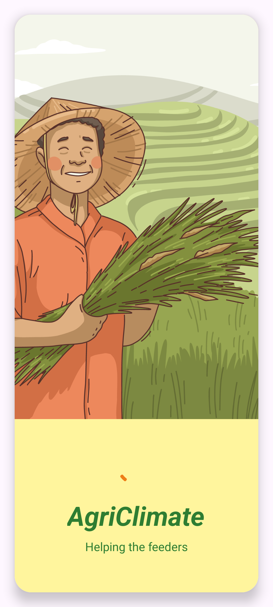
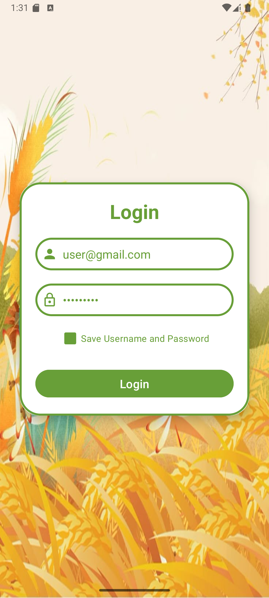
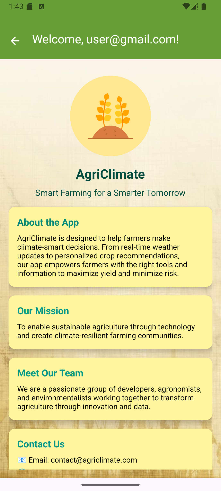
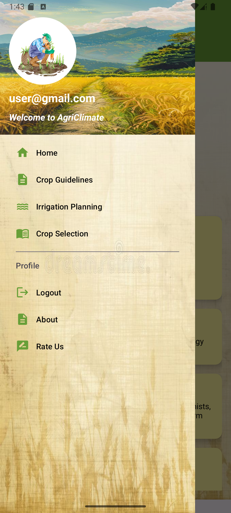
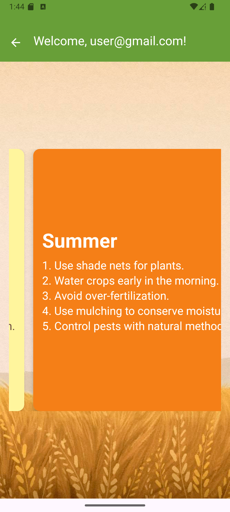
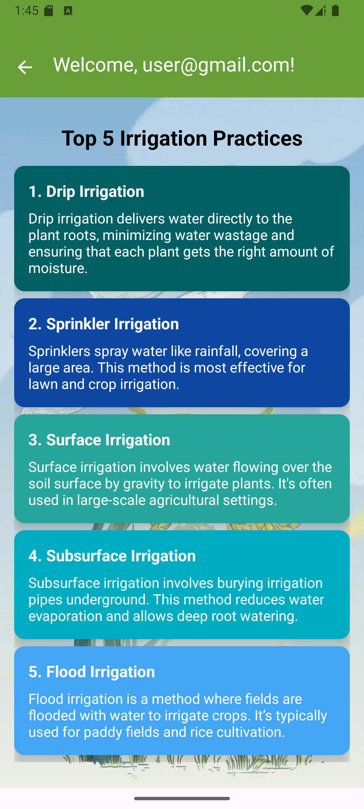

# 🌾 AgriClimate

AgriClimate is an Android application designed to help farmers make **climate-smart decisions**. From **real-time weather updates** to **personalized crop recommendations**, our app empowers rural
farming communities with the tools and insights needed to maximize yield and minimize climate-related risks.

---

## 📋 Table of Contents

- [🌾 AgriClimate](#-agriclimate)
  - [📋 Table of Contents](#-table-of-contents)
  - [📖 About](#-about)
    - [🎯 Mission](#-mission)
    - [👥 Team](#-team)
  - [✨ Features](#-features)
  - [🖼 Screenshots](#-screenshots)
  - [🛠 Tech Stack](#-tech-stack)
  - [🚀 Installation \& Running the App](#-installation--running-the-app)
  - [🤝 Contributing](#-contributing)
  - [📄 License](#-license)
  - [Authors](#authors)

---

## 📖 About

**AgriClimate** is designed to help farmers make climate-smart decisions. From real-time weather updates to personalized crop recommendations, our app empowers farmers with the right tools and information to maximize yield and minimize risk.

### 🎯 Mission

To enable sustainable agriculture through technology and create climate-resilient farming communities.

### 👥 Team

We are a passionate group of developers, agronomists, and environmentalists working together to transform agriculture through innovation and data.

---

## ✨ Features

- 🔐 **Login Screen** using **SharedPreferences** (for session persistence)
- 🌀 **Splash Screen** with animated icon
- ⭐ **Custom Rating Bar** for user feedback
- 📑 **Toolbar** with navigation support
- 🧾 **ScrollView & CardViews** for organized content layout
- 🧩 **Dynamic Fragments** for flexible UI rendering
- 📂 **Navigation Drawer** for seamless user navigation
- 🌐 **Weather Integration** (planned/future)

---

## 🖼 Screenshots

| Splash Screen                                     | Login Screen                                           | Home Screen                                       |
| ------------------------------------------------- | ------------------------------------------------------ | ------------------------------------------------- |
|          |                 |              |
| Navigation Drawer                                 | Crop Guidelines Screen                                 | Irrigation Practices Screen                       |
|  |  |  |

---

## 🛠 Tech Stack

- **Language:** Kotlin
- **UI Components:** Fragments, CardViews, Toolbar, Navigation Drawer
- **Storage:** SharedPreferences
- **Theme:** Material3 Light Theme

---

## 🚀 Installation & Running the App

1. Clone the repository:

   ```bash
   git clone https://github.com/Aaditya-Kumar-Mittal/AgriClimate-Kotlin-App.git
   ```

2. Open the project in **Android Studio**.

3. Build the project and run on an emulator or physical device.

---

## 🤝 Contributing

We welcome contributions! If you'd like to improve the app, feel free to fork the repository and submit a pull request.

---

## 📄 License

This project is licensed under the MIT License - see the [LICENSE](LICENSE) file for details.
